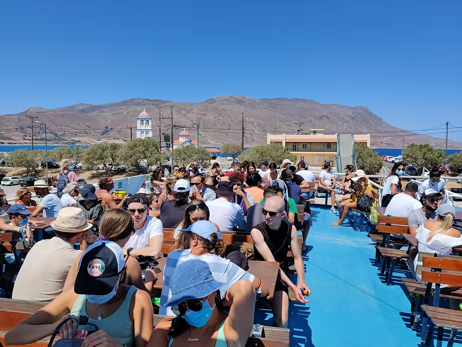

Сещате ли се за онези диви плажове насред пустошта, със ситен, бял пясък и кристално синя вода? Тази непорочна любов между необятното синьо, докосващо горещия пясък... И не, това не е на хиляди километри от тук, а само на крачка разстояние. Протягаме се и неусетно между ръцете ни се изплъзват почти снежно белите песъчинки, а по краката ни се наслоява солта от Средиземноморската ни прегръдка с тюркоазеното море. Тук сме — на Балос, от който ни дели час и половина полет и още час-два "земноводен" и спиращ дъха с изумителните си гледки преход до лагуната, сгушила се в една от най-западните точки на остров Крит.

## Как да стигнем до там?

Не, изобщо не е сложно. Ние тръгнахме от Ханя.

### *По суша*

С една бърза проверка в Google Maps виждаме, че разстоянието е едва около 50 км и се стига за малко повече от час. Но честно казано, не бих препоръчала този вариант. От един момент нататък пътят става черен — каменист, песъчлив и много тесен. И не може да ви отведе директно до плажа: от най-близкия паркинг над Балос (да, намира се над лагуната), трябва да се повърви още около 20–30 минути по стълби. Колата или моторът могат да бъдат лесно повредени без възможност за ремонт наблизо. А изкачването по същите стълби на 35–40° след слънчево изгаряне на плажа не звучи като най-привлекателният вариант — нооо... все пак е възможен.

### *С автобус + ферибот*

Да, този вариант е напълно възможен с най-добрата автобусна компания, която някога съм виждала и ползвала — **KTEL**. Предлага превоз до почти всяко кътче на острова, което си заслужава да бъде посетено. Разписанието го има онлайн. Обикновено автобусите тръгват рано сутринта; автобусите за връщане започват от 4 следобяд в зависимост от дестинацията.

Преди да тръгнем за Балос обмислихме варианта да си купим онлайн билет, но не бяхме сигурни дали ще се събудим навреме и решихме да отидем малко по-рано на автогарата в Ханя. Купихме си билети за пристанище Кисамос, от където тръгва ферибот за Балос. Като започнахме да се качваме в автобуса, се оказа, че няма достатъчно места — но след около 10 минути пристигна минибус и успяхме да стигнем навреме за ферибота.

За самия ферибот: опасявахме се от измами при онлайн покупка (познаваме такива случаи от Статуята на свободата) и решихме да купим на място. Имаше ферибот около 10:30, но за него нямаше места и затова взехме следващия в 12:40. На пристанището има заведение, където спокойно може да изчакате. Определено препоръчвам варианта с ферибот — заради спиращите дъха гледки на тюркоазеното синьо, малките лодчици и вятъра в косите.

<video width="100%" controls>
  <source src="/balos.mp4" type="video/mp4">
  Your browser does not support the video tag.
</video>

## Първа спирка — Грамвуса

Самата разходка с ферибота предлага тази програма — разглеждане на малкия, девствен остров Грамвуса за около час, преди да се отдадете на Балос. Ако сте запалени историци, пред вас се открива възможността да посетите Венецианската крепост на върха на острова — построена през XVI век по време на борбата срещу Османската империя и едно от последните превзети укрепления на Крит.

А ако сте почитатели на морето, потопете се в кристално сините води на това вълшебно кътче. Плажът започва с плитка част, като изведнъж навлиза доста надълбоко — идеален за гмуркане сред красива фауна и останки от корабокруширали кораби. Не забравяйте плувните очила и водните обувки — водата е изключително солена, а дъното е каменисто.

Не се качихме до крепостта, защото имахме ограничено време и решихме да се отдадем на морето. Времето мина неусетно, а крайната дестинация вече ни очакваше.

## Следваща спирка — кулминацията — плаж Балос

Ето ни и на магичното място, закътано сякаш на край света, приветстващо със своята тишина и спираща дъха красота — своят лазурен бряг, електриково синьо, чистота и девственост.

Подобна на Елафониси, плажната ивица е обградена от двете страни от море. От едната страна, от която пристигнахме, водата е студена и дълбока. От другата може да се насладите на истинско джакузи сред природата — скали, мирис на море и топли плитки басейни.

  
  
  

И също като Елафониси, има мокър розов пясък — но само на места и с много по-слабо изразен розов цвят.

  
  

Имаше възможност за наемане на чадър и шезлонг, но почти всичко беше заето — очаквано. На острова има едно единствено малко кiosче, от което си взехме само вода. Искахме да прекараме цялото време, наслаждавайки се на дивата и непокътната природа, кристалната вода, жарещото слънце и несравнимата красота.

Както всичко хубаво, времето мина неусетно и корабчето пристигна. Престоят ни на Балос беше около три часа.

На тръгване се натъкнахме на неочакван и мил изпращач:

Дали пък това не е Амалтея — нимфата, откърмила Зевс? 🤔
